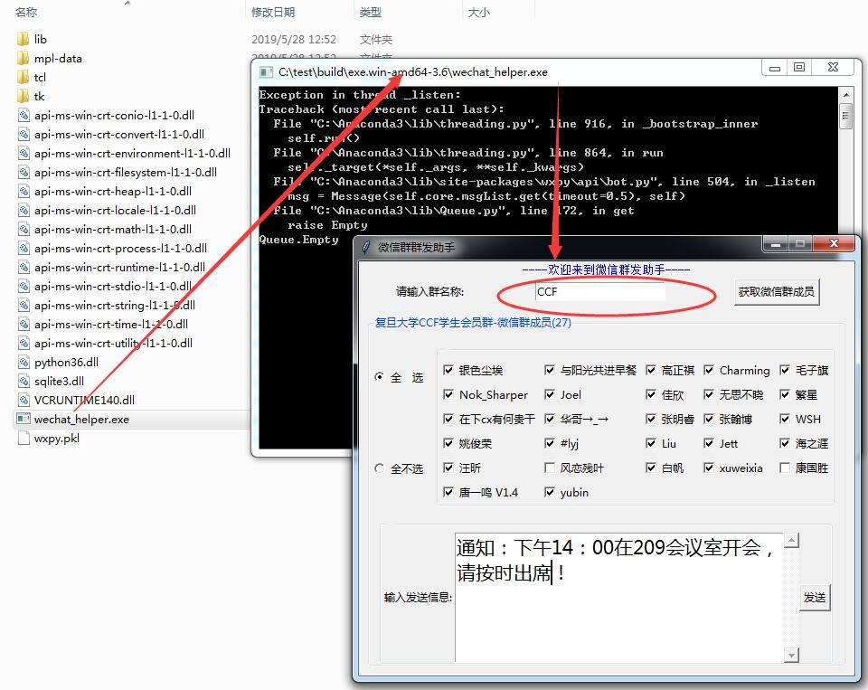

## 功能介绍
给微信群中选择的群成员分别发送消息

## 开发动机
1. 一般人们会有很多微信群，因此很多人会屏蔽微信群消息，即便@所有人，也不会看，或偶尔选择看一下，这样容易错过一些重要消息，因此为了让群成员看到消息，我们选择单独给每个群成员发，而不是发群消息。
2. 微信群中，有一些成员我们可能觉得他们不需要知道该消息，因此在给群成员发消息时，只选择需要的群成员发送，而非每个人都发，造成打扰。

## 使用包说明
+ **Tkinter**：Tkinter 是 Python 的标准 GUI 库,是python内置的安装包。
+ **wxpy**：pip wxpy -i http://pypi.douban.com/simple --trusted-host pypi.douban.com

## 源代码（两个版本）
+ [wechat_helper_v0.py](wechat_helper_v0.py) 未封装成类版本
+ [wechat_helper.py](wechat_helper.py) 封装成类版本

注意：窗口icon不自定义使用图标，否则安装后可能会因为找不到文件而报错。

## 打包成安装文件 **.msi
1. 安装cxfreeze：pip cxfreeze -i http://pypi.douban.com/simple --trusted-host pypi.douban.com
2. 新建[setup.py](setup.py)文件，其中注意wechat_helper.icon文件(**.exe的图标文件)的放置在当前路径，cion图标可以由其他格式的图片文件通过网上[在线转化](https://image.online-convert.com/convert-to-ico)生成。
3. cmd执行命令行：python setup.py bdist_msi

执行命令后生成两个文件夹：
+ **build**：免安装文件
+ **dist**：安装文件 **.msi

## 软件使用说明

安装 wechat_helper-0.1-amd64.msi (链接：https://pan.baidu.com/s/1tTwKUX45e9M10BLJ6UAK9w 
提取码：3m9y)

在安装目下，找到 wechat_helper.exe，双击可以运行

首先会弹出命令行，提示扫码登录微信。然后，登录后会弹出窗口，即可搜索微信群，选择群成员并发送信息。
+ 搜索微信群支持模糊搜索，当匹配多个时，需要输入精确的群名称
+ 当选择群成员不是你的好友时，会提示消息发送失败
：

## 开发经验总结
+ 你能想到的都能办到，所以必须先要想到问题，然后才能想办法解决。
+ 多花时间琢磨，有些即便找不到资料，也能猜个大概，不断试错就能解决问题。
